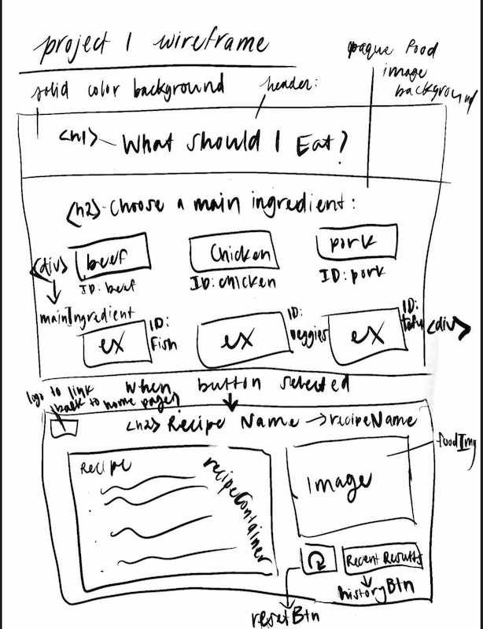

# What Should I Eat?- Team Project

## Summary

What Should I Eat? is a random recipe generator. A user will select one of the four main ingredient buttons and a random recipe, including the chosen main ingredient will appear. What Should I Eat? was created with the idea that a user has a main ingredient in mind, but is in search of a few recipe options.

The following is the original user story for What Should I Eat?

> AS A busy person  
> I WANT TO be able to get a recipe by selecting a main ingredient  
> SO THAT I can review photos & recipes that match what I have available at home  

## Technologies Used

[Foundation](https://get.foundation/)  

Server-side APIs 
[MealDB](www.themealdb.com/api/json/v1/1/)  
[Pixabay.com](https://pixabay.com/api/)

## Mockup

### Original Wireframe -

## Link To Application

[Deployed Web Page](https://vinetteg.github.io/WhatShouldIEat_Project1/)  
[Team Repo](https://github.com/vinetteg/WhatShouldIEat_Project1)

## Team

Selma Burke  
Kyle Canoy  
Vinette Gutierrez  
Danny Roubin  
